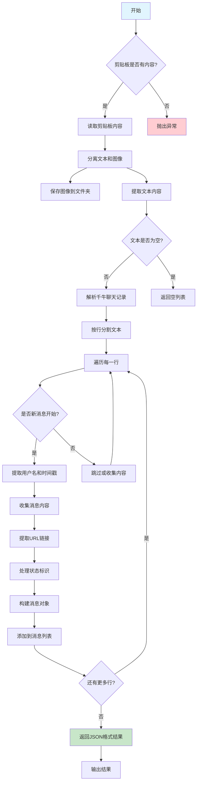
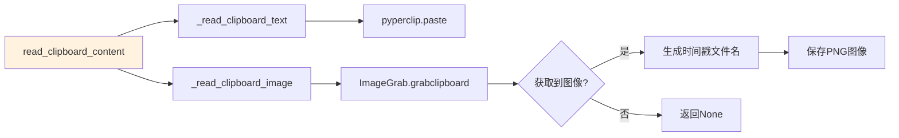
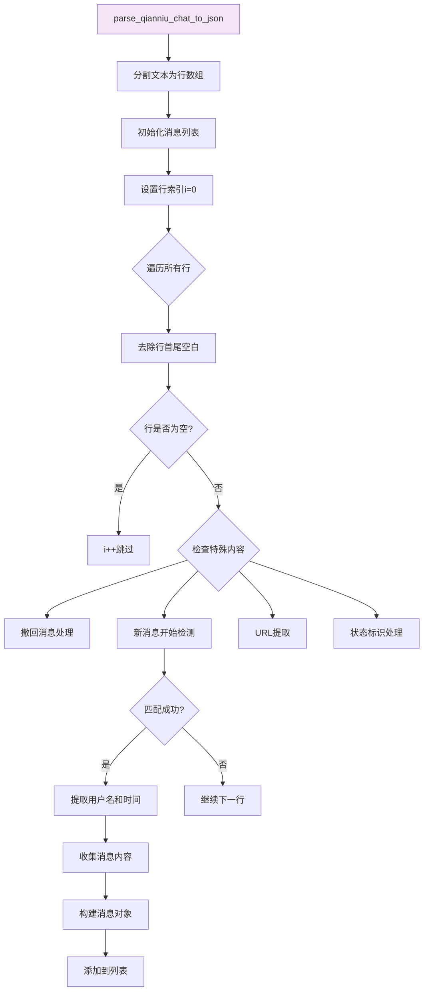
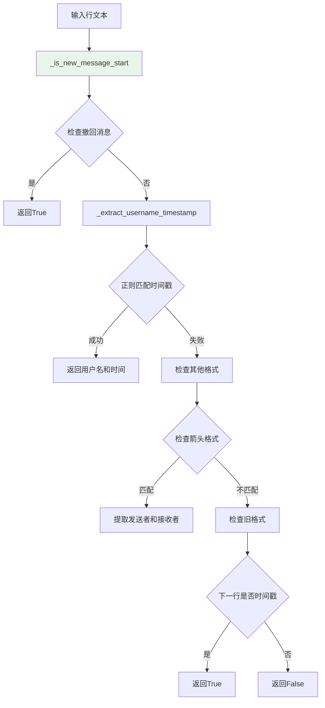
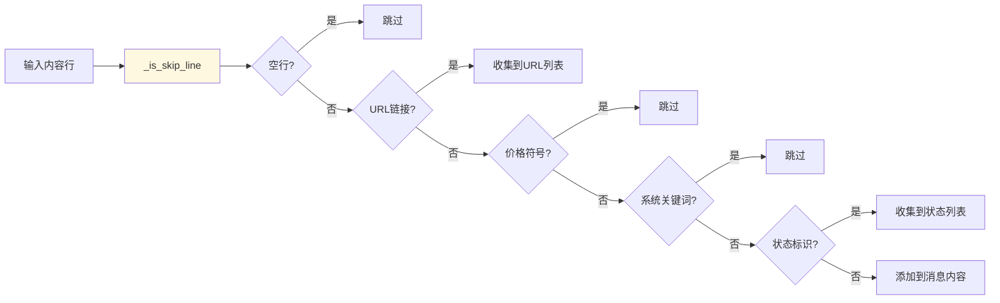
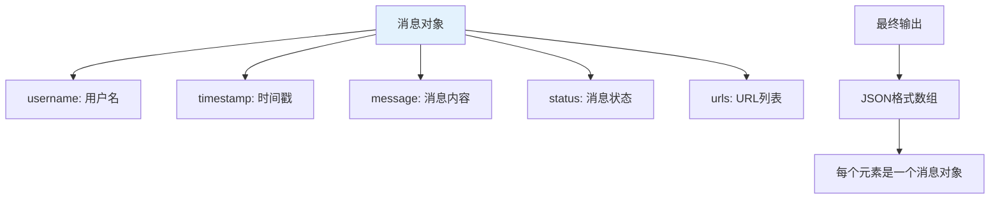
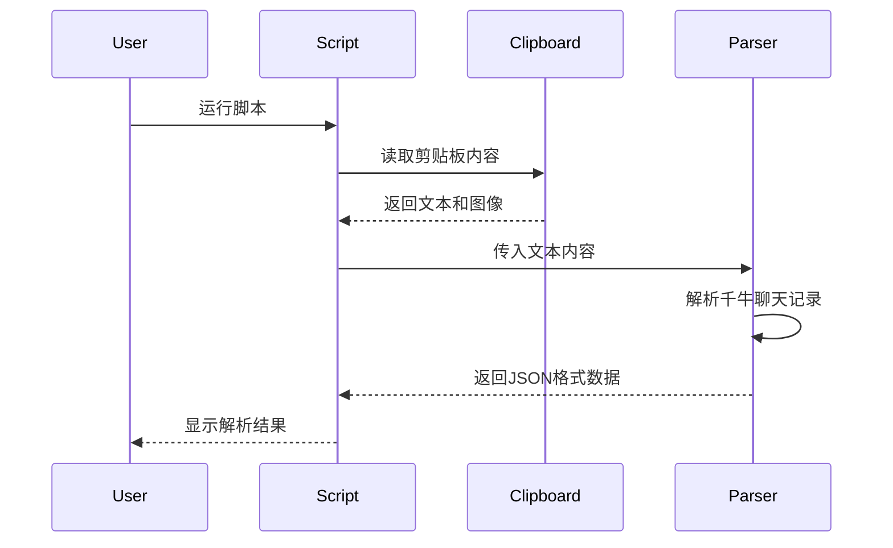
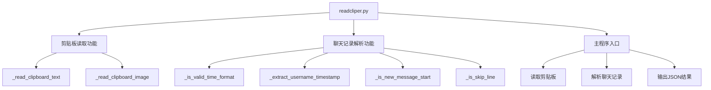

# readcliper.py 功能介绍

## 项目概述
`readcliper.py` 是一个用于读取剪贴板内容并解析千牛聊天记录的 Python 工具。

## 功能架构图



## 核心功能模块

### 1. 剪贴板读取模块


### 2. 聊天记录解析模块


## 消息格式识别



## 内容过滤机制



## 输出数据结构



## 使用示例

### 基本使用流程


### 支持的聊天记录格式

1. **标准格式**:
   ```
   用户名
   2024-01-15 14:30:25
   消息内容
   已读
   ```

2. **紧凑格式**:
   ```
   用户名2024-01-15 14:30:25
   消息内容
   ```

3. **转交格式**:
   ```
   用户A --> 用户B 2024-01-15 14:30:25
   消息内容
   ```

4. **包含URL**:
   ```
   用户名2024-01-15 14:30:25
   消息内容
   http://example.com
   已读
   ```

## 文件结构



## 安装依赖

```bash
pip install pyperclip pillow pywin32
```

## 运行方式

```bash
python readcliper.py
```

## 注意事项

1. **图像保存**: 剪贴板中的图像会自动保存到指定文件夹
2. **文本编码**: 支持中文和特殊字符处理
3. **格式兼容**: 支持多种千牛聊天记录格式
4. **错误处理**: 包含完善的异常处理机制
5. **URL提取**: 自动识别和提取消息中的URL链接