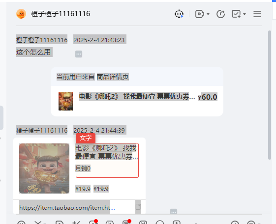

# 千牛客服聊天数据导出

**经验分享**

**wuqi312666**

影刀见习开发者

发布于 2025-09-19 17:24**更新于** **2025-09-19 17:32**6浏览    [影刀rpa 经验贴 千牛客服聊天数据导出](https://www.yingdao.com/community/detaildiscuss?id=865159944564609024&tag=%E7%BB%8F%E9%AA%8C%E5%88%86%E4%BA%AB&from=article)

有大佬python代码去hook请求的聊天数据，运行python

**1 背景**：

最新版的千牛工作台（pc,exe文件）

---



**2 实现流程: ****ctr+A 可以全选；循环采集用户id；查询的方式进入每个聊天框**

**1 循环鼠标**：下滑采集所以用户的id：------方便搜索后直接进入聊天界面



<iframe class="blockly" contenteditable="false" id="blockly-038b0f0d-9b15-4fee-b14b-5640af246b23" src="https://www.yingdao.com/community/rpa-flow/rpa-flow?id=blockly-038b0f0d-9b15-4fee-b14b-5640af246b23" data-w-e-type="xbot-flow-blocks" data-w-e-is-void="" data-blocks="https://winrobot-pub-a.oss-cn-hangzhou.aliyuncs.com/716004238616969218/file/demand/temp-1758273894302" version="1.0.1" content-type="1"></iframe>



**2 循环搜索每个userId：**

全新聊天内容+python代码吧获得文本转换成json（时间，url，user，status）字典的value存入对应的用户id



<iframe class="blockly" contenteditable="false" id="blockly-499745d6-cf17-4bb6-b4b5-ce0c719d0e7a" src="https://www.yingdao.com/community/rpa-flow/rpa-flow?id=blockly-499745d6-cf17-4bb6-b4b5-ce0c719d0e7a" data-w-e-type="xbot-flow-blocks" data-w-e-is-void="" data-blocks="https://winrobot-pub-a.oss-cn-hangzhou.aliyuncs.com/716004238616969218/file/demand/temp-1758273894009" version="1.0.1" content-type="1"></iframe>





---



**3 过程：ctr+A 可以全选；循环采集用户id；查询的方式进入每个聊天框**

尝试：影刀自带的扩展指令，不过运行20s，只是打开了界面，但是采集到数据；

尝试：charles抓包，没有任何有关聊天记的包数据，获取加密了。找到的资料需要hook这个软件的 C代码和内存地址。

尝试：安装社区大家提示的方法：修改为讲述人模式





没效果：(忘记重启了)，---重启后的可以读取具体每个对话的 user time message 和订单的文本内容了

尝试：社区伙伴说需要老版本的千牛工作台；也有社区伙伴说 设置：接待设置为 文本模式





这一次发下聊天消息可以** ctr+A ctr+C复制了**





**获取文本**

    1 鼠标左下到右上就+滚动鼠标滚轮向上---就可以选择所以所有文本（但是这样操作太慢了）---html读取剪贴板：读取出文本，腾讯表格闻到读取是图片，语雀读取的也是图片。

    2 AIIde Trea ：python读取不出图片：但是读取得出url

    3 修改为文本模式后，ctr+A 就可以全选聊天记录数据---python读取数据后，返回json{user,status,nessges,url,images}

**尝试：如何获取打开每个聊天记录？**

1 键盘的↓是可以珠峰移动的，但是？点击后就失效了，需要元素框的空白处，才能继续使用？↓键盘来移动到下一个用户

2 一个页面只有12个：+不抓漏，不抓重复？+影刀

3 获取不到useid:编辑器看懂的userid 在属性 ：ux Name，但是运行提示没有属性。使用扩展指令打印所以的属性win。发下userid在Name中。再次重试成功了。

    原理win元素的属性在内置的编码的方法中。__involve__ 这个参数里面

**尝试****：**社区伙伴分析的懒加载，不过没有win元素的，不过提到核心就是慢慢滑动，然后去重。



a 于是使用循环采集当月页面的数据userid到列表

b 使用鼠标滚动的方式下滑（进度条捕获不到）

循环：a,b就得到所以的用户id，使用集合函数Set，对列表去重。
