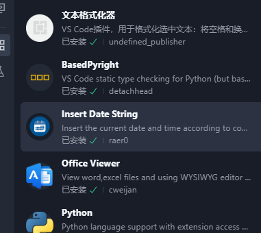
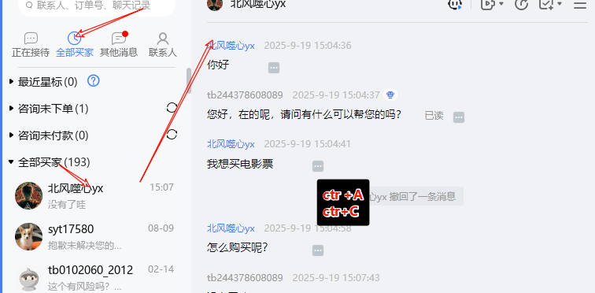
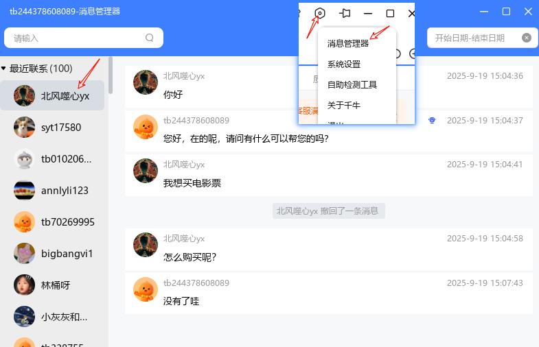
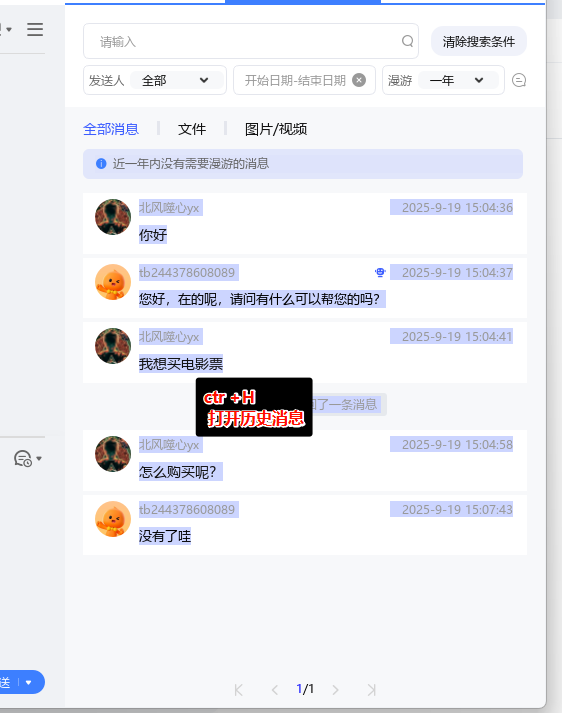

千牛客服聊天数据导出  2025-09-1917:56:53




1 遍历每个客户---按键--↓这个遍历每个每个客户的选择框
2 聊天记录框：左下角鼠标按住一直拖动到左上角，同时鼠标滚轮向上滚动
3 键盘ctr+C  可以复制到图片和文本
4 聊天消息出现在连个地方




5 第二个地方：消息管理器




3 进入用户中心后：



如何点入所以所有用户页面？

获取user的id

一个页面只有12个：不抓漏，不抓重复？


```python
python
```
