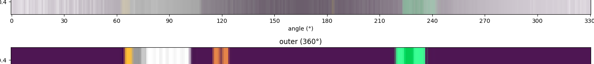
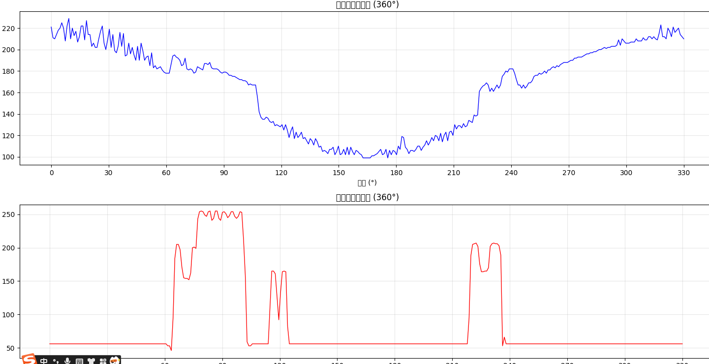

# 得出大小圆是处理 内外圆的半径

    用于分割正方向图片中的内圆和外圆，并提供了交互式界面以调整内外圆直径。
    你可以运行代码并通过交互式滑块设置直径来查看分割效果。

# 得出圆周半径

读取图片并自动计算圆心坐标

1.在360°圆周上均匀采样

2.指定数量的点（默认360个点）

3.返回内外圆圆周的像素值 （BGR格式）

4.包含安全边界检查 ，确保坐标在图像范围内

5.提供可视化功能来显示像素分布

灰度图展示亮度曲线

